# Huginn Installation and Onboarding Contract

This document defines the human experience from a verified firmware release to
a configured Huginn device. It is an implementation contract: a screen, action,
or safety check described here must be present and testable before it is
described as supported.

The current serial-only bring-up image does **not** implement this journey yet.
It exists to prove boot, recovery, and rollback on physical hardware first.

## Product surfaces

| Surface | Purpose | Must not do |
| --- | --- | --- |
| Browser flasher | Install one reviewed release and explain recovery. | Select a device, flash, or recover silently. |
| First-boot setup portal | Establish owner access and device configuration. | Expose existing credentials or enable unsupported hardware. |
| Phone control page | Present supported device status and controls after setup. | Claim a capability that the device has not declared. |
| Telegram conversational control | Give an authorized owner a typed conversational path to supported functions. | Run arbitrary shell, pin, radio, or raw-capture commands. |
| Muninn desktop companion | Provide detailed USB diagnostics and configuration. | Replace firmware recovery or bypass owner authorization. |

## Owner journey

```mermaid
flowchart LR
  A[Confirm the exact supported board] --> B[Open Huginn Flasher]
  B --> C[Select a reviewed release]
  C --> D[Owner selects serial device and authorizes install]
  D --> E[Huginn first boot]
  E --> F[Join temporary setup connection]
  F --> G[Complete setup portal]
  G --> H[Confirm network and owner pairing]
  H --> I[Use phone control page or Telegram]
```

Each step must show the owner what is happening, what information is needed,
what will change, and how to recover if the step fails.

## 1. Browser flasher

Before showing an install button, the flasher must:

1. Identify the exact board profile required by the selected release.
2. Positively verify the selected serial target against that profile before
   writing. Verification must include the supported chip family and flash
   layout, plus a signed Huginn board-profile response when firmware capable of
   providing one is already present. A release must remain blocked when the
   target cannot be verified to the manifest's requirements.
3. Display release version, source reference, checksums, normal image,
   recovery image, and recovery instructions.
4. Explain that the owner must choose the serial device themselves.
5. Block installation when the manifest, target verification, board profile,
   checksum, or recovery
   evidence is incomplete.
6. Offer a clear exit path to the recovery guide if installation is interrupted.

For an unprovisioned board where ROM cannot prove an exact board profile, the
browser flasher must not substitute a guess or a user-selected serial port for
positive verification. The controlled serial bring-up process remains the
approved first-install path until a read-only hardware-identification method is
implemented and reviewed.

After a successful install, the page should say that first boot continues on
the device's local setup connection. It must not claim that the device is
configured until that setup has completed.

## 2. First boot and local setup connection

An unconfigured device must show a clear first-boot state. The primary
phone-friendly path is a temporary local Wi-Fi setup portal. Bluetooth may be
added later as a discovery or pairing aid, but it is not a substitute for a
clear browser-based setup flow.

The device must display or make available:

- a recognizable temporary setup-network name;
- a unique, non-default WPA2 or WPA3 setup-network credential, delivered to
  the owner through a device label, QR code, or equivalent protected channel;
- an HTTPS portal using a per-device certificate, or an equivalently
  confidential application-layer pairing channel before it accepts secrets;
- a short instruction to open the local setup page;
- a recovery instruction when setup cannot start.

The temporary setup connection must expire or be disabled after successful
configuration. It must never expose stored network credentials, bot tokens, or
owner identifiers in page content, logs, or diagnostic exports.

## 3. Setup portal

The portal should use a small number of numbered screens, with back and cancel
actions that preserve safety:

1. **Welcome and device identity** — board profile, firmware version, and an
   explanation of what setup will change.
2. **Owner access** — establish local owner access and show how it can be
   reset through documented physical recovery.
3. **Network connection** — select or enter a network, validate the attempt,
   and report success or an actionable failure. Credentials are stored only in
   protected device configuration and accepted only through the confidential
   setup channel.
4. **Telegram and conversational control** — optionally enter a Telegram bot
   token and authorize the owner chat. Show that the bot is limited to typed
   Huginn capabilities. The token is redacted immediately after submission.
5. **Review and apply** — show a redacted summary of the changes, then require
   explicit confirmation before applying and restarting.
6. **Completion** — show the normal control-page address or connection method,
   explain Telegram pairing status, and link to recovery guidance.

No onboarding page may make unverified claims about radio, display, sensor,
Meshtastic, AI, or external-adapter functionality.

## 4. Normal phone control page

The normal control page is a device status and supported-control surface. Its
first version should include:

- device identity, firmware version, connection state, and last health result;
- declared modes and capabilities, including a plain explanation for unavailable
  functions;
- safe configuration changes that the firmware schema validates;
- sanitized activity and error history;
- a visible route to recovery instructions.

It must not become a generic device shell. Every control maps to a versioned,
typed Huginn capability and reports queued, running, succeeded, failed, or
unavailable state honestly.

## 5. Failure and recovery experience

| Situation | Required human-facing response |
| --- | --- |
| Unsupported board | Stop installation and identify the required board profile. |
| Interrupted flash | Explain how to return to the verified recovery image. |
| Setup connection unavailable | Show the physical recovery route and avoid guessing a network state. |
| Network connection fails | Preserve the owner in setup mode, redact credentials, and explain the retry path. |
| Telegram pairing fails | Keep the device usable locally, redact the token, and show a retry path. |
| Owner access lost | Explain the documented physical recovery/reset process and its data impact. |

## Implementation gates

Before the onboarding flow is released, it must have:

1. A verified flashable Huginn release and physical recovery evidence.
2. A versioned USB and local-control protocol that identifies the exact board
   and firmware before accepting configuration.
3. Tests for first-time setup, cancellation, failed network join, failed
   Telegram pairing, owner reset, recovery after an interrupted update, wrong
   target rejection before flashing, and setup-secret confidentiality.
4. A human-readable quick-start guide tested by someone following it without
   developer-only instructions.

Muninn should consume the same identity, configuration, capability, and job
contracts after this flow is established. It must not create an alternate
onboarding path that disagrees with Huginn.
